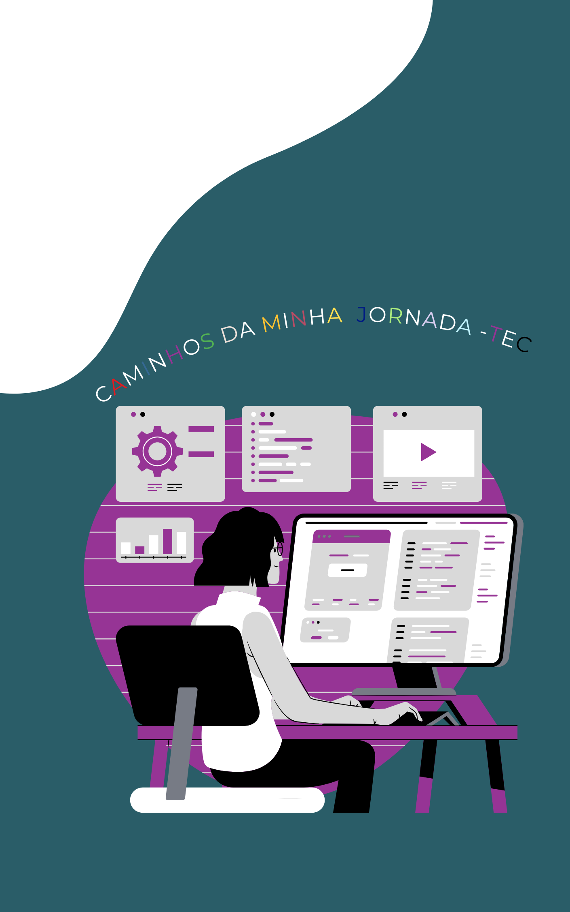
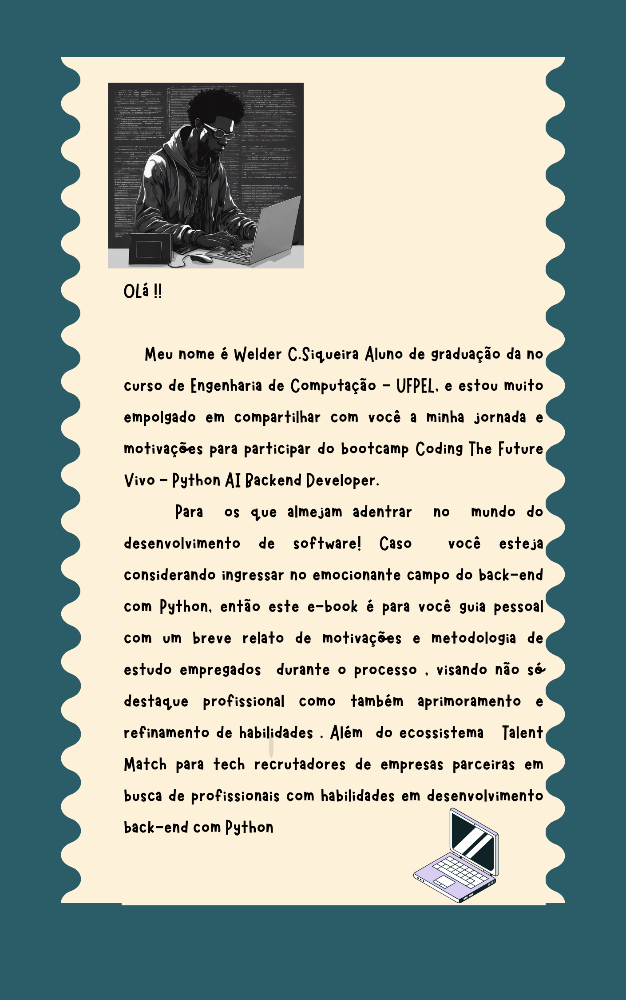
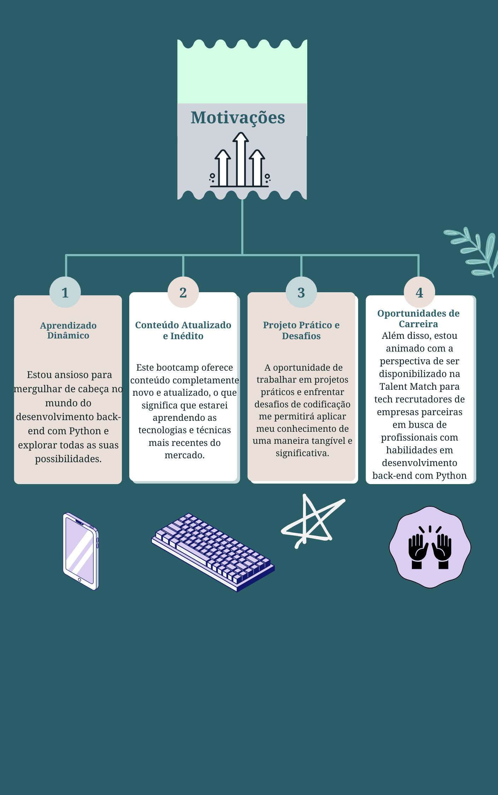
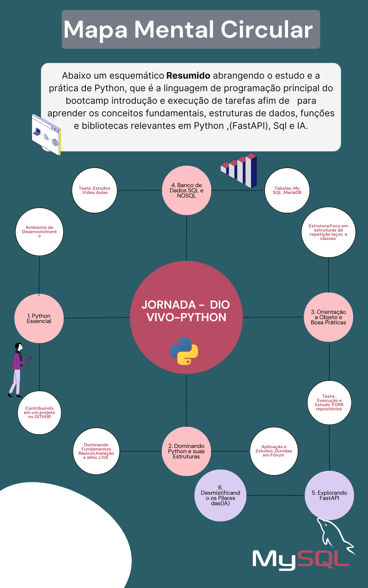
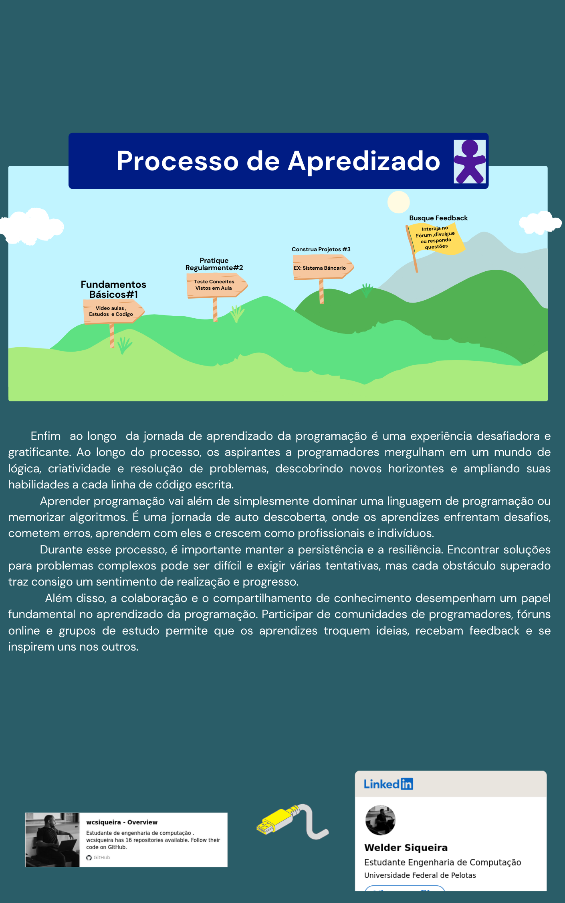

# Natural ou Fake Natty? Como Vencer na Era das IAs Generativas

## 🚀 Introdução

> Woooow! Look at this 👀

Olá pessoal, Venilton da DIO aqui! Inspirado na hype _"Natty or Not"_ do fisiculturismo, este Lab da DIO te convida a conhecer o mundo das IAs Generativas, explorando o potencial dessas tendências tecnológicas incríveis!

## 🎯 Bora Pro Desafio!? Você Já Venceu 💪🤓

### Objetivos

1. **Explorar IAs Generativas**: Utilize essas tecnologias para criar conteúdos que sejam o mais realista possível. Seja criativo! Você pode produzir imagens, textos, áudios, vídeos ou combinações de tudo isso!
1. **Potfólio de Projetos**:
    1. Faça o "fork" deste repositório, criando uma cópia em seu GitHub pessoal;
    2. Edite seu README com os detalhes do seu projeto, siga nosso [Template](#template) (é só copiar, colar e preencher);
    3. Submeta o link do seu repositório na plataforma da DIO. Pronto, você acabou de fortalecer seu portfólio de projetos nos perfis do GitHub e DIO 🚀
1. **Efeito de Rede**: Compartilhe seus resultados nas redes sociais com a hashtag **#LabDIONattyOrNot**. Não esqueça de nos marcar: [DIO](https://www.linkedin.com/school/dio-makethechange) e [falvojr](https://www.linkedin.com/in/falvojr).

### Template

```markdown
# E-Book MINHA JORNADA-TEC 

## 📒 Descrição
NESTE EBOOK DEMONSTRO minhas Motivações e metodos de estudos como uso de mapas mentais ,estudos e  o processo de aprendizagem  utlizado para Python e banco de dados 

## 🤖 Tecnologias Utilizadas
As IAs Generativas e outras ferramentas usadas  foram as seguintes , Chat GPT,Bing , DreamStudio, Canvas .

## 🧐 Processo de Criação
Para criar o conteúdo deste eBook, primeiramente defini minhas motivações e objetivos para entrar no bootcamp Coding The Future Vivo - Python AI Backend Developer. Em seguida, organizei minhas ideias usando mapas mentais para estruturar os tópicos principais que gostaria de abordar. Utilizei ferramentas como Chat GPT para gerar e refinar o texto, Bing para pesquisa adicional, DreamStudio para criação de gráficos e ilustrações, e Canvas para montagem e design final do eBook. O processo envolveu a escrita inicial, revisão e aprimoramento contínuo, bem como a integração de feedback de mentores e colegas.

## 🚀 Resultados
Os resultados do meu projeto foram bastante satisfatórios. Consegui criar um eBook organizado e informativo que reflete minhas experiências e aprendizados ao longo do bootcamp. O uso de tecnologias avançadas facilitou a criação de um conteúdo de alta qualidade, permitindo uma apresentação clara e profissional das informações. Além disso, o processo me ajudou a consolidar meu conhecimento em Python e bancos de dados, bem como a aprimorar minhas habilidades em design e organização de conteúdo.

## 💭 Reflexão (Opcional)
Criar algo 'natty' com IA foi um desafio interessante. A principal dificuldade foi manter a originalidade e a pessoalidade enquanto utilizava ferramentas de IA para gerar e melhorar o conteúdo. No entanto, esse processo também mostrou o potencial das tecnologias de IA para facilitar a criação de materiais complexos e de alta qualidade. A experiência me ensinou a equilibrar a automação com a criatividade humana, resultando em um produto final que é tanto eficiente quanto autêntico.

```
<html lang="en">
<head>
    <meta charset="UTF-8">
    <meta name="viewport" content="width=device-width, initial-scale=1.0">
    <title>E-BOOK-MINHA JORNADA-TEC (DIO-python-VIVO)</title>
    <style>
        body {
            font-family: Arial, sans-serif;
            margin: 0;
            padding: 0;
            display: flex;
            flex-direction: column;
            align-items: center;
            background-color: #f5f5f5;
            color: #333;
        }
        .title {
            font-size: 2em;
            font-weight: bold;
            text-align: center;
            margin-top: 20px;
            padding: 10px;
            background-color: #0073e6;
            color: white;
            border-radius: 10px;
            width: 80%;
        }
        .image-container {
            display: flex;
            justify-content: space-around;
            align-items: center;
            margin: 20px 0;
            flex-wrap: wrap;
        }
        .image-container img {
            width: 100px;
            height: auto;
            margin: 10px;
            border: 2px solid #0073e6;
            border-radius: 5px;
        }
    </style>
</head>
<body>
    <div style="display: flex; justify-content: space-around; align-items: center;">
        
        
        
        
        
    </div>
</body>
</html>

### Exemplos e Insigths

- [E-BOOK](/exemplos/E-BOOK.md)
- [Podcast](/exemplos/PODCAST.md)
- [Vídeo (Avatar Virtual)](/exemplos/VIDEO.md)

## Links Interessantes

[Base10: If You’re Not First, You’re Last: How AI Becomes Mission Critical](https://base10.vc/post/generative-ai-mission-critical/)


